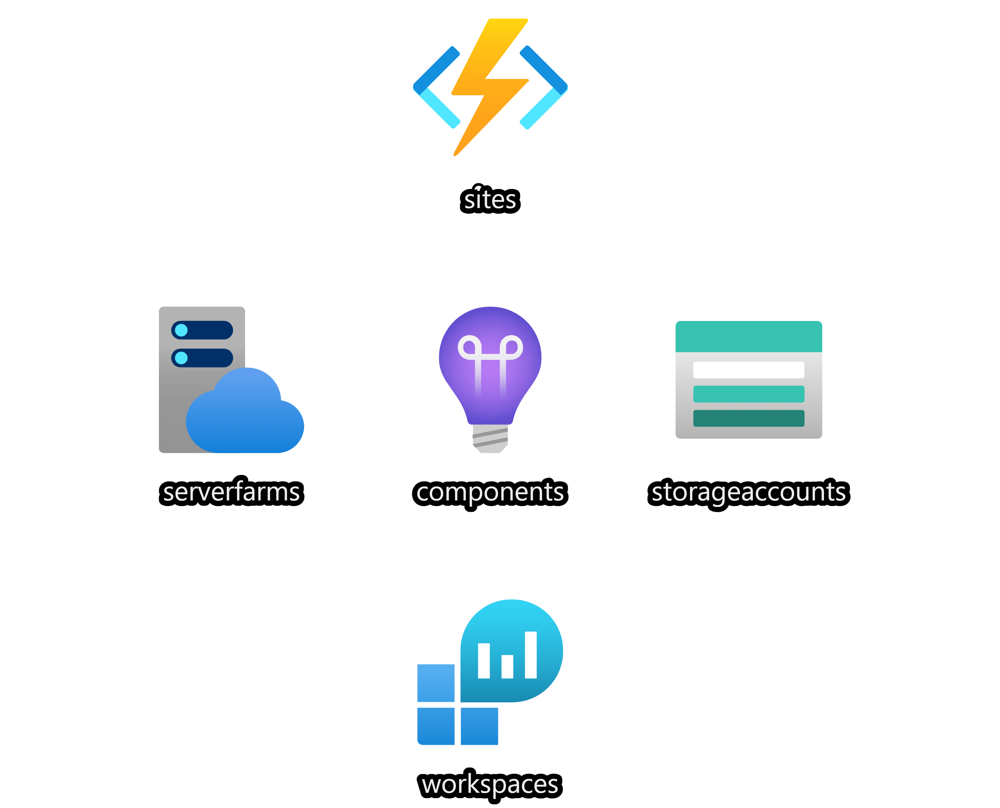

# logic-apps-standard

Demonstrates how to automate the deployment of Logic Apps Standard into Azure

## Azure Architecture
The following diagram describes the general architecture of Azure services depicted in this solution.

## GitHub Workflow
The included workflow performs the following tasks:

- Build: package the Logic App Standard
- Deploy to Azure logicapp-dev
- Deploy to Azure logicapp-prd

Each of the Deployment stage will:

- Create the resource group if it doesn't exist
- Provision and create Azure resources using an Azure Resource Manager Template
- Deploy the Logic App Standard package to the Workflow Service (sites in the architecture diagram)

## References

- https://docs.microsoft.com/en-us/azure/logic-apps/single-tenant-overview-compare
- https://docs.microsoft.com/en-us/azure/logic-apps/create-single-tenant-workflows-visual-studio-code
- https://docs.microsoft.com/en-us/azure/developer/github/deploy-to-azure
- https://docs.microsoft.com/en-us/azure/logic-apps/set-up-devops-deployment-single-tenant-azure-logic-apps?tabs=github
- https://docs.microsoft.com/en-us/azure/templates/
